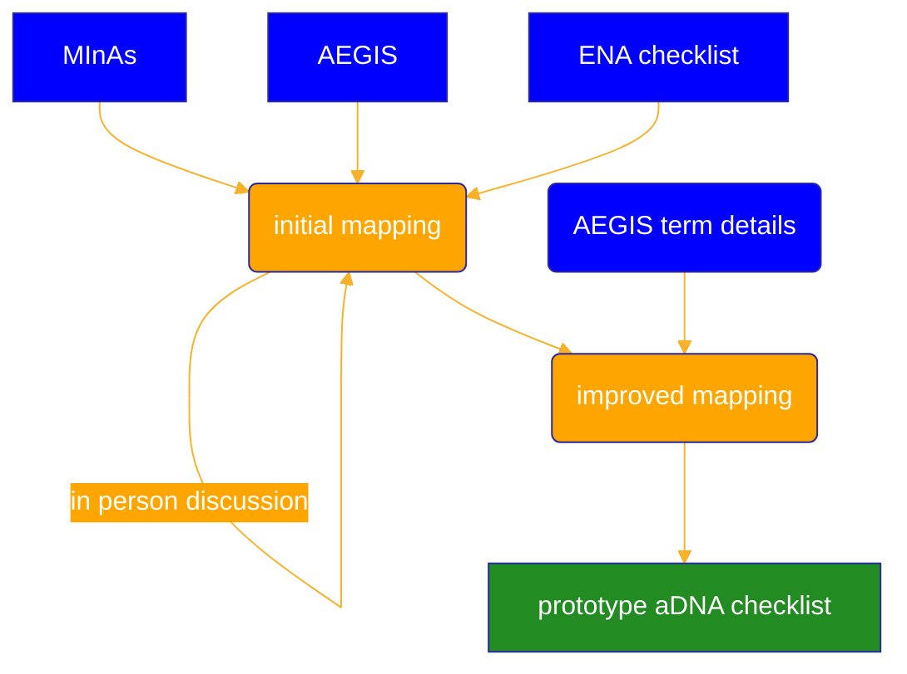

```mermaid
---
config:
  theme: 'base'
  themeVariables:
    primaryColor: 'blue'
    primaryTextColor: '#fff'
    lineColor: '#F8B229'
    secondaryColor: '#FFA500'
    tertiaryColor: '#fff'
---
  
    flowchart TD
    A[MInAs] -->mapping(initial mapping):::progress
    AEGIS[AEGIS] --> mapping
    ENA_checklist[ENA checklist] --> mapping
    mapping --"in person discussion"--> mapping
    mapping --> mapping_imp(improved mapping):::progress
    
    AEGIS_IMP(AEGIS term details)--> mapping_imp
    mapping_imp -- "  "--> prot_checklist[prototype aDNA checklist]:::done
    
    classDef progress fill:#FFA500
    classDef done fill:#228B22
    
    
```
